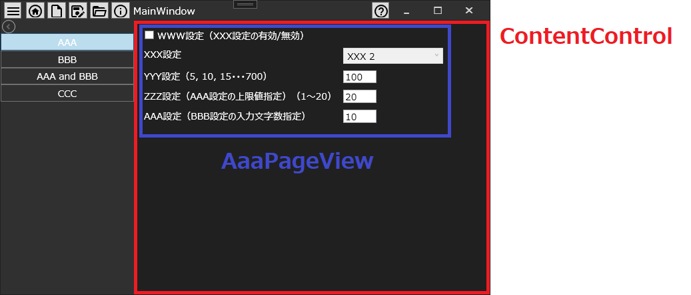
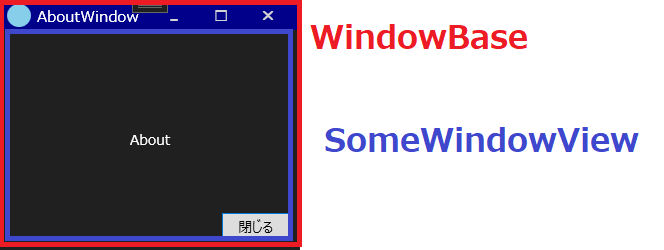

# 基礎設計

## 1. 概要

製品仕様に大きく影響されない、設定用PCアプリケーションに共通的な部分に関する基礎設計を示す。

## 2. 開発環境

プログラム言語：C＃

UIフレームワーク：WPF  

IDE：Visual Studio 2022  

OSS：  
ReactiveProperty（for 変更通知機構）  
Microsoft.Xaml.Behaviors.Wpf（for WPFコントロール機能拡張用Behavior）  
Microsoft.Extensions.DependencyInjection（for 依存性の注入、DIコンテナ）

## 3. 要点

設計の要点は以下の通り。  

- Windowsアプリケーション開発で良く採用されるMVVMアーキテクチャは、GUI設計に特化したアーキテクチャ（GUIアーキテクチャ）であることから、通信やデータ永続化などの内部処理を含めたアプリケーション全体の要素を配置するためには、Modelが肥大化・複雑化してしまい、開発効率や品質の低下を招く。  
全体の要素を適切に配置設計するために、GUI含めたシステム全体を対象としたアーキテクチャ（システムアーキテクチャ）であるオニオンアーキテクチャを採用することで、開発効率と品質を向上させる。
- 全体に対してはシステムアーキテクチャであるオニオンアーキテクチャを適用し、GUIに関してはGUIアーキテクチャであるMVVMアーキテクチャを適用した、複合アーキテクチャとなっている。
- オニオンアーキテクチャに沿ってモジュール分割することで、実装箇所の明確化、高い堅牢性、高い変更容易性、設計の標準化を実現。
- 高凝集・疎結合にモジュールが分割されていることから、モジュールごとにテストコードやテストアプリが作りやすく、他モジュールの進捗に依存せずにモジュール単位での機能作り込みが可能。

## 4. 設計要素・前提となる知識

設計で採用している要素片（設計パターン、ライブラリ、etc.）の概要は以下の通り。  

- ドメイン  
「ソフトウェアを使って問題解決しようとしている領域」や「プログラムを適用する対象となる業務領域」のなどを指す。

- ドメインモデル  
アプリケーションのドメインを、オブジェクトのモデルとして整理したもの。

- ドメインロジック  
ドメインにおける「ルール」「要求」など。

- オニオンアーキテクチャ  
Jeffrey Palermo氏により考案されたアーキテクチャパターンで、伝統的な階層化アーキテクチャとオブジェクト指向の考え方を踏襲しつつ、これまでよりも保守性、テスト容易性、依存性の点で優れたアプリケーションを構築することを目的としている。

- MVVM  
MVVMはソフトウェアをModel・View・ViewModelの3要素に分割する。プレゼンテーションとドメインを分離し（V-VM / M）また宣言的Viewを分離し状態とマッピングを別にもつ（V / VM）ことでソフトウェアの保守性・開発生産性を向上させる。

- ReactiveProperty  
Reactive Extensions で MVVM および非同期サポート機能を提供するライブラリ。

- Entity  
Value Objectと並びドメインモデル (ドメインオブジェクト) の中心的な要素で、ドメイン内のさまざまなビジネスの実体の概念をモデル化するのに用いられ

- Value Object  
Entityと並びドメインモデル (ドメインオブジェクト) の中心的な要素で、ドメイン内のさまざまな値の概念をモデル化するのに用いられる。

- Behavior  
Viewのコードビハインドにイベントハンドラを書くことなく何かアクションをさせるための部品。

- DI (Dependency Injection)  
依存性の注入と訳される。  
あるオブジェクトや関数が、依存する他のオブジェクトや関数を受け取るデザインパターン。

- DIコンテナ  
ソフトウェア開発において内部のソフトウェア部品（コンポーネント）間の依存性の管理を行うことができるようにするソフトウェア。

## 5. アーキテクチャ設計

PCアプリケーションを設計する上で、守備範囲の異なる「システムアーキテクチャ」と「GUIアーキテクチャ」のそれぞれの視点での設計を示す。

>システムアーキテクチャとは "GUI"アーキテクチャの汎用性を増したもの。  
さらに詳しくいうと、"システム"アーキテクチャは、"GUI"アーキテクチャよりも広い、UIという単位にとらわれることなくシステム全体の構造を示せるもの。
「システムアーキテクチャ > GUIアーキテクチャ」  

>GUIアーキテクチャは、Viewからの視点で、構造化設計を実践する際の具体的なレイヤー構造をパターンとして示したもの。  



## 6. システムアーキテクチャ設計

本章では、GUIアーキテクチャ範囲を除外したシステムアーキテクチャの設計を示す。

### 6.1. システムアーキテクチャ　レイヤー設計

オニオンアーキテクチャの考え方に沿ったレイヤー設計として、以下のレイヤー分割を行った。

- Domain Model層
- Domain Service層
- Application Service層
- Infrastructure層
- User Interface層


各層の機能概要を以下に示す。

#### 6.1.1. Domain Model層

- ビジネスドメインのコアロジックやビジネスルールを表現する。
- ドメインモデルはEntity、Value Objectなどで構成され、ビジネスオブジェクトとその振る舞いを表現する。

#### 6.1.2. Domain Service層

- ドメインモデルが持つ責務の一部を凝集させている
- ドメインモデルに直接関連する操作や、複数のドメインオブジェクトにまたがる操作を提供
- ドメインサービスは、ビジネスルールやビジネスロジックの実装を含む場合があり、ドメインモデルの一部として表現されることもある

#### 6.1.3. Application Service層

- アプリケーションの振る舞いを実装
- ユーザーインターフェースや外部APIとのやり取りを処理し、ビジネスロジックの組み立てやドメインモデルへの操作を行う
- アプリケーションサービスは、ドメインモデルの操作の組み合わせによってユースケースを実現する。
トランザクションの管理やエラーハンドリングも担当

#### 6.1.4. Infrastructure層

- データベース、キャッシング、外部サービス、ログ出力、メッセージングなど、外部要素とのやり取りを担当
- データの永続化や取得、外部サービスへのリクエストなど、ドメインモデルやアプリケーションサービスの要求を満たす役割

#### 6.1.5. User Interface層

GUIアーキテクチャの守備範囲のため、後述する。

### 6.2. システムアーキテクチャ　コンポーネント設計

前述の各層の中に、それぞれの機能が凝集されたコンポーネントを配置する。


各層の各コンポーネントの詳細は以下に示す。

#### 6.2.1. Domain Model層コンポーネント


Domain Model層のコンポーネント概要を以下に示す。

##### 6.2.1.1. 各種Entity

機能まとまり単位の設定値クラス群（Value Object）とその集約（EEntity）、またそれらの制限機能を配置するコンポーネント。  
設定値のインポート/エクスポートのためのプリミティブなデータのみを抱える小袋クラス（Data Packet）も定義する。

##### 6.2.1.2. Domain Model Common

各Entityが参照するValue Objectの基底クラスや、プリミティブ型の拡張機能クラス等の基底機能を配置するコンポーネント。

#### 6.2.2. Domain Service層コンポーネント


Domain Service層のコンポーネント概要を以下に示す。

##### 6.2.2.1. Domain Service

Domain Model層の各Entityを跨いだ処理クラスを格納するコンポーネント。

ex.  
２つのEntityがあると仮定して、一方のEntity内の設定値が変更された際に、その変更に応じてもう一方のEntity内の設定値を自動変更する処理。

##### 6.2.2.2. Repository

Entityのインスタンスを取得・格納するリポジトリのインターフェースを格納するコンポーネント。  
リポジトリインターフェースの実装クラスはInfrastructure層に配置される。

#### 6.2.3. Application Service層コンポーネント


Application Service層のコンポーネント概要を以下に示す。

##### 6.2.3.1. Usecase

アプリケーションのユースケース単位で、ドメインロジックやインフラ機能を利用して機能を実現するクラスを配置するコンポーネント。

ex.  
Domain Service層のRepositoryから設定値を取得して、Featureコンポーネントのデータファイルクラスに設定データファイルの保存を依頼する、「データを保存する」ユースケースクラス。

##### 6.2.3.2. Feature

Domain Model層のドメインデータをプリミティブ型のデータに変換、もしくはその逆の変換を行い、Infrastructure層の外部依存機能を利用する機能クラスを格納するコンポーネント。

ex.  
Domain Service層のRepositoryから取得された設定値インスタンス群を外部データ仕様に沿った形式（ex. json）に変換して、Infrastructure層のデータファイル保存クラスにファイル保存を依頼する、「データファイルアクセス」クラス。

#### 6.2.4. Infrastructure層コンポーネント


Infrastructure層のコンポーネント概要を以下に示す。

##### 6.2.4.1. File Accessor

Application Service層からの依頼を受けて、各種ファイルを生成しストレージに保存する機能クラスを配置するコンポーネント。
ファイルの暗号化や一定期間区切りのログファイル生成、Excelデータ操作ライブラリを利用したデータのエクスポートなど、ドメインロジックに含まれない非機能要求を実現するための実装等も配置される。

##### 6.2.4.2. In Memory Repository

Domain Service層のRespositoryコンポーネントで定義したインターフェースを実現するクラスを配置するコンポーネント。  
オニオンアーキテクチャの基礎的な実現方法について書かれたウェブ記事などでは、このコンポーネントはデータベースアクセスを実装するものとなっており、複合的なテーブル操作の知識を実装するためのコンポーネントとされている。  
本設計においては、データベースを利用しない予定となっているため、メモリ上にEntityオブジェクトを保持して、そのオブジェクトを提供・上書き保存する機能のみを有する。

#### 6.2.5. User Interface層コンポーネント

GUIアーキテクチャの守備範囲のため、後述する。

### 6.3. システムアーキテクチャ　ユースケース

Application Service層のUsecaseコンポーネントで実現する各種ユースケースのシーケンスを以下に示す。

#### 6.3.1. 設定値表示

画面に表示する設定値を取得する流れを示す。


RepositoryがEntityインスタンスを保持しているため、そこから設定値情報を保持するEntityインスタンスを取得する。
Entityインスタンスを取得する際にはディープクローンによる複製インスタンスを提供する。これはアプリケーションが保持する設定値情報の変更窓口をRepositoryに統一するためで、アプリケーションが保持する設定情報であるEntityインスタンスをそのまま参照渡ししてしまうことで、Repositoryを経由せずに参照渡しされたEntityインスタンスを直接変更してアプリケーションが保持する設定値情報が変更できてしまうことを防いでいる。

#### 6.3.2. 設定値確定

画面上での設定値変更を、アプリケーションの保持する設定値として確定する流れを示す。


設定値表示時同様、アプリケーションが保持する設定値情報の変更窓口をRepositoryに統一するため、ディープクローンした複製EntityインスタンスをRepositoryに格納する。

#### 6.3.3. 設定データファイル保存

アプリケーションの保持する設定値を設定データファイルとして保存する流れを示す。


Application Service層まではドメインモデルを参照した処理を行っており、Infrastructure層はドメインモデルに依存しないようにしている。そのため、Application Service層のData File Accessorでドメインモデルからプリミティブ型（JSON形式の文字列）への変換を行っている。

#### 6.3.4. 設定データファイル読み込み

アプリケーションに保持させる設定値を設定データファイルから読み込む流れを示す。


設定データファイルから読み込まれたJSON形式テキストをApplication Service層でドメインモデル（Data Packet）に変換している。  
読み込まれたData Packetは各Entityにインポートし、Entityの変更を確定することで設定データファイルの情報をアプリケーションに取り込む。

Data Packetのインポート時に設定範囲外例外が発生した際にそのデータを捨てて「開く」を異常終了することを想定して、Entityの変更確定はインポートが全て正常終了した後に行う。

#### 6.3.5. 設定値初期化

アプリケーションの保持する設定値を初期化する流れを示す。


初期値が設定されているEntityの初期インスタンスをアプリケーションの設定値として確定する。

## 7. GUIアーキテクチャ設計

本章では、システムアーキテクチャ章で除外した、GUIアーキテクチャ部であるUser interface層の設計を示す。

### 7.1. GUIアーキテクチャ（User interface層）　レイヤー設計

MVVMの考え方に沿ったレイヤー設計として、以下のレイヤー分割を行った。

- Model
- View
- View Model


各層の機能概要を以下に示す。

#### 7.1.1. Model層

広義のModel層は、アプリケーションのドメインロジックを担う、そのアプリケーションが扱う領域のデータと手続きを表現する要素を配置する層。  
UIロジックを一切含めない。

ex.  
ショッピングの合計額や送料を計算する。

本設計においては、ドメインロジックはシステムアーキテクチャとして各層に高凝集に配置されており、既に必要な機能はそちらで実現されているため、Model層の責務は以下のものに限られる。

- 画面に表示される設定値を集約するEntityを画面内テンポラリとして保持する。
- ユースケースに応じた処理は、Application Service層のUsecaseコンポーネントに処理を委譲する。

#### 7.1.2. View層

アプリケーションの扱うデータをユーザーが見るのに適した形で表示し、ユーザーからの入力を受け取る要素を配置する層。  
ドメインロジックを一切含めない。

ex.  

- 画面レイアウト、デザイン
- アニメーション
- 入力文字制限

#### 7.1.3. ViewModel層

Model層とView層との中間層。  
ViewとModelの間の情報の伝達（変換）と、Viewのための状態保持のみを役割とする要素を配置する層。  

ex.  
チェックボックス設定項目 AAA, BBB, CCCが全てチェックされた場合のみ、あるUI要素がEnableになる。

```c#
class Model{
    public bool Aaa;
    public bool Bbb;
    public bool Ccc;
}

class ViewModel{
    Model model;
    public bool IsEnabled
    {
        get
        {
            return model.Aaa && model.Bbb && model.Ccc; //※ここ
        }
    }
}
```

### 7.2. カスタムMVVM（Model & View+ViewModel）

本設計では、概念的にはMVVMに則って物理的なファイル構成として「Model & View & ViewModel」の形をとっているが、クラス設計上は「Model & View+ViewModel」としている。

原則的なMVVMである「Model & View & ViewModel」を実現するためには、ViewModelからViewを制御するために「Message」「Trigger」「Action」の設計・実装スキルが要求される。
これは、ViewとViewModelの依存度を下げることが出来るバインドの仕組みで駆動するイベントで、ViewとViewModelの依存度を低く保つことに貢献する。  
ViewとViewModelの依存度を下げることで、デザイナ（View）とプログラマ（ViewModel）の分業が円滑になる、ViewとViewModelのユニットテストが実施しやすくなる、Viewの差し替えが容易になる、等のメリットがある。  


しかし、現状の現場ではそれらはほぼ行われておらず、必要性のないメリットを享受するために原則的なMVVMを採用する学習・設計・実装コストは単なる無駄となるため、無駄を排除した「Model & View+ViewModel」を採用する。  
「Model & View+ViewModel」はViewとViewModel機能が1つのクラスとなるため、ViewModelからViewの制御を直接的に操作できる。


### 7.3. User interface層　コンポーネント設計


User interface層のコンポーネント概要を以下に示す。

#### 7.3.1. スタートプロジェクト(WpfApp1)

アプリケーションのエントリーポイントクラスを格納するコンポーネント。  
アプリケーション起動時/終了時シーケンスを実装する。

アプリケーション起動時処理として、DIコンテナのサービス構築を行う。

#### 7.3.2. WPF Library

BehaviorやIConverterの実装、WPFコントロールの機能拡張など、WPFを拡張する機能クラスを格納するコンポーネント。  
GUIアーキテクチャのViewに関わる機能のみ。

#### 7.3.3. UI Parts

各画面のMVVMクラス、画面に配置するUser Control等のUI画面とその部品、そしてそれらのデザインリソースを格納するコンポーネント。

### 7.4. GUIアーキテクチャ　クラス構成

主要な2画面（Main Window, 汎用Dialog）のGUIアーキテクチャ　クラス構成を以下に示す。

#### 7.4.1. Main Window

Main Windowの画面概要とクラス構成を以下に示す。

##### 7.4.1.1. Main Window　画面概要

Main Windowの主要な画面構成は以下の通り。  

ContentControlに表示するUserControlを切り替えることにより、画面切り替えを実現している。



##### 7.4.1.2. Main Window クラス構成

Main Windowのクラス構成は以下の通り。


MainWindowBaseクラス：  
タイトルバーをカスタマイズするためにWindowChromeを利用したカスタムウィンドウベースクラスWindow Baseを基底クラスとして、タイトルバーへの機能追加等を行ったメイン画面用のウィンドウベースクラス。

MainWindowViewクラス：  
メインウィンドウのView+ViewModelクラス。  
View内に配置したContentControlに各機能画面のPageを表示する。

MainWindowModelクラス：  
メインウィンドウのModelクラス。  
メインウィンドウのViewに配置された「初期化」「保存」「開く」ボタンの押下をトリガーにModelのそれぞれに対応したメソッドが叩かれるが、実処理はModelが参照している各Usecaseに委譲する。

AaaPageViewクラス、AaaPageModelクラス：  
機能画面のView＋ViewModel、Modelクラス。  
Main Windowと同様に、各機能画面UserControl自体もMVVM構造となっており、各機能画面単位でも一般的なMVVMアプリ開発知識をもとに開発を進めることが出来るため、学習コストを下げられている。  
Main Windowと同様に、必要なドメインロジックはUsecaseに委譲されているため、AAA Page画面に必要な個別ロジックのみが高凝集に実装される。

#### 7.4.2. 汎用的なDialog

汎用的なDialogの画面概要とクラス構成を以下に示す。

##### 7.4.2.1. 汎用的なDialog　画面概要

汎用的なDialogの主要な画面構成は以下の通り。  

WindowBaseクラスを基底クラスとして、そのクライアントエリアである下記のSomeWindowView領域に任意のコンテンツを表示する。  
WindowBaseクラス側でタイトルバーのカスタマイズを実現しているため、任意コンテンツ側ではそれを意識する必要がない。



##### 7.4.2.2. 汎用的なDialog クラス構成

汎用的なDialogのクラス構成は以下の通り。


WindowBaseクラス：  
タイトルバーをカスタマイズするためにWindowChromeを利用したカスタムウィンドウベースクラス。

SomeEntity, SomeUsecase：  
Main WindowのPageと同様に、アプリケーションが保持する設定データの表示・変更が必要であれば、そのEntityを参照する。また、ドメインロジックを操作する必要がある場合にはそれに対応したUsecaseを参照する。  
どちらも、不要であれば参照する必要はない。(例えば、About画面のようにアプリケーション名とVersion情報程度の内容であれば、EntityとUsecaseどちらも参照不要。)
